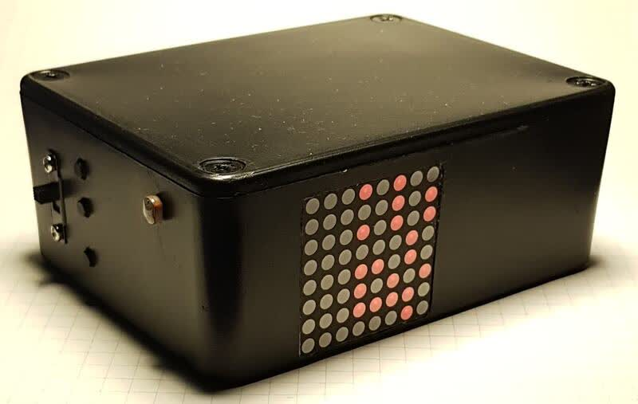
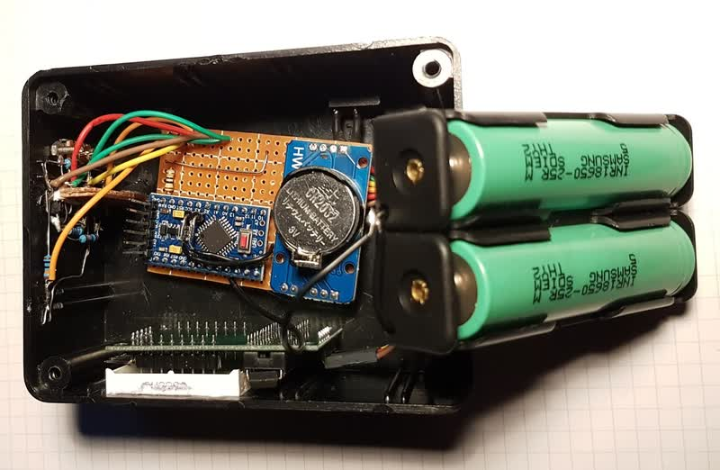
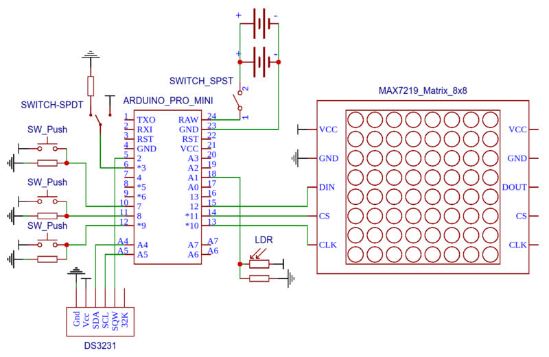

# Arduino Binary Clock

A detailed description of my process on creating an Arduino binary clock



# Hardware Components

- 100 x 75 x 40mm Project Enclosure Box
- Arduino Pro Mini
- 8×8 LED Matrix MAX7219
- DS3231 RTC module
- 26650 Battery x2
- 26650 Battery holder x2
- SPDT switch x2
- Push button x3




# Power saving features

## Reducing Clock Speed

```
CLKPR = 0x80; // enable changing
CLKPR = 0x04; // 1 MHz ( 16MHz / 16 (2^04) )
```

## Interrupts and Deep Sleep

after every loop enter deep sleep mode until awoken by interrupt that is connected to RTC square wave generator that is triggered every second

```
void nullFunction() {}
setup() {
  ...
  rtc.setSquareWave1HZ(true);
  attachInterrupt(CLOCK_PULSE_INTERRUPT, nullFunction, FALLING); // every second
}
loop() {
  // --- update time by 1 second ---
  ...
  LowPower.powerDown(SLEEP_FOREVER, ADC_OFF, BOD_OFF);
}
```

## Other power reductions

- reduced calls to RTC module
- using bitwize operator `&` in place of modulus operator `%` when checking if number is divisible by a power of 2
- Reduced calls to LED Matrix module by caching led state in memory

# Libraries Used

- [RTClib](https://github.com/adafruit/RTClib)
- [LedControl](https://github.com/wayoda/LedControl)
